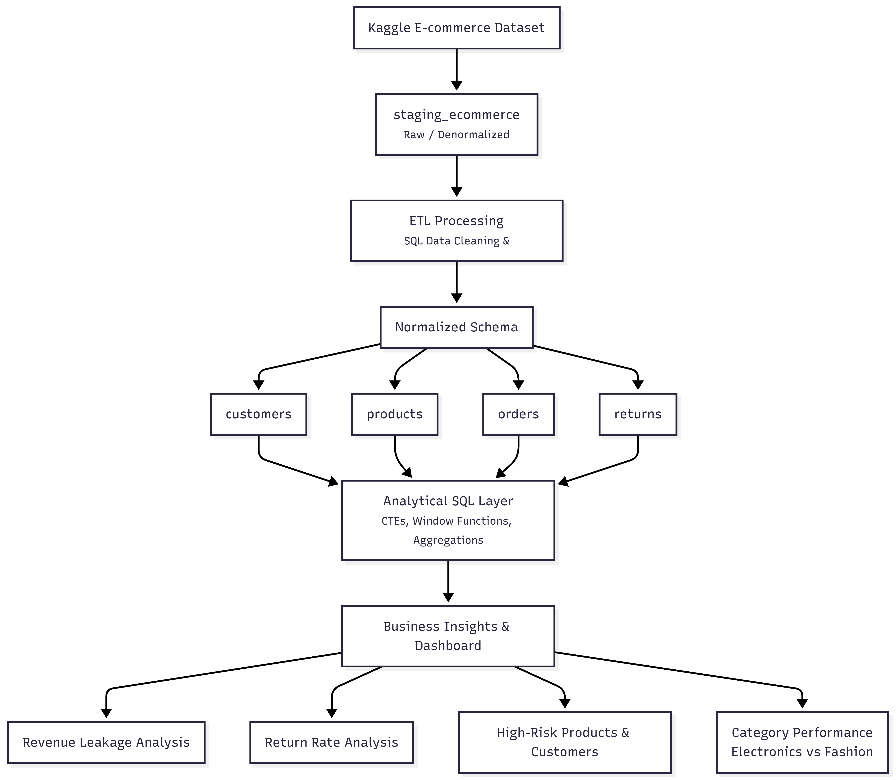

## Project Architecture

### Architecture Flow

**1. Source Layer**
- **Kaggle Dataset** — Original raw CSV files (`orders.csv`, `products.csv`, `customers.csv`, `returns.csv`, and the wide staging file)

**2. Staging Layer**
- `staging_ecommerce` — Raw, denormalized table containing all data in a single wide format

**3. ETL Layer**
- **ETL Processing (SQL)** — Data cleaning, transformation, date standardization, and calculation of derived fields (e.g., return loss, net revenue)

**4. Normalized Layer**
- Structured relational schema consisting of:
  - `customers`
  - `products`
  - `orders`
  - `returns`

**5. Analytical Layer**
- **Analytical SQL Layer** — Complex queries using CTEs, window functions, aggregations, and joins to compute:
  - Return rates (by revenue and by orders)
  - Revenue leakage
  - High-risk products and customers
  - Category-level performance

**6. Insight & Visualization Layer**
- **Business Insights & KPIs** delivered through Power BI Dashboard, including:
  - Revenue Analysis & Leakage
  - Customer Segmentation & Risk Scoring
  - Product Performance & Pareto Analysis
  - Category Analysis (Electronics vs Fashion focus)

---

### Key Design Principles
- **Layered Approach**: Clear separation between raw data, staging, normalized schema, and analytical logic
- **SQL-Centric**: All transformations and analysis performed using SQL for reproducibility and performance
- **Scalability**: The normalized structure allows easy extension for future analysis (e.g., adding return reasons or trends)
- **Business Focus**: Final layer translates technical outputs into actionable insights for profit improvement

This architecture enabled efficient identification of the major return loss drivers — particularly in the Electronics category and a small group of high-loss products.
