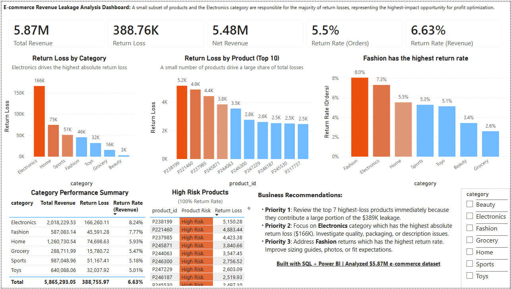

# E-Commerce Revenue Leakage Analysis — SQL-Driven Return Investigation


> **$389K in return-driven revenue loss identified** across a $5.87M e-commerce operation — with SQL-driven segmentation pinpointing exactly where to act first.

This analysis delivers end-to-end SQL investigation: data modeling and normalization, KPI design, customer risk segmentation, Pareto loss analysis, cohort behavior tracking, and business-oriented decision support — all translated into a Power BI dashboard.

## TL;DR

- Found **$389K recoverable revenue loss (5.52%)**
- Identified a **small High Risk segment (42 customers, 53.41% avg return rate)**, but found that it drives only **5.35%** of total return loss
- Showed that the much larger **Moderate Risk segment drives 57.2% of total return loss**
- Flagged **Electronics ($166K loss)** as the highest-impact category
- Identified several **high-loss, high-loss-rate products** as the clearest recovery opportunities
- Delivered a **SQL + Power BI monitoring system** for ongoing leakage tracking

---

## Key Metrics

| Metric | Value |
|:---|---:|
| Gross Revenue | $5,865,293 |
| Return Loss | $388,756 |
| Net Revenue | $5,476,537 |
| Overall Return Rate | 5.52% |

---

## Key Findings

- **Electronics** generates the most revenue and the most return loss ($166K), making it the single highest-impact category for intervention
- **Fashion** has the highest return rate at **8.05%**, suggesting expectation mismatch is likely a stronger issue than product defect volume alone
- **Return-related loss is broader than a simple 80/20 product story**: several products show severe leakage, but loss is not concentrated enough to support a clean “few bad SKUs explain everything” narrative
- **Customer  risk and customer financial impact are not the same thing**: the most extreme returners are not the largest source of total loss
- The **High Risk** segment is ally extreme, but the much larger **Moderate Risk** segment drives most total return loss through scale, accounting for **57.2%** of leakage

---

## Dashboard Preview



> Built in Power BI · Revenue overview · Customer risk segmentation · Category breakdown · Product loss concentration

This dashboard enables:

- Real-time tracking of return-driven revenue loss
- Identification of high-risk customers and products
- Early detection of category-level return spikes
- Ongoing monitoring of recovery opportunities

---

## Business Recommendations

Based on SQL findings, the highest-leverage interventions are:

1. **Audit the highest-loss and highest-loss-rate products first** — product-level leakage is severe enough to justify immediate SKU review, even though the loss pattern is broader than a simple top-5 explanation

2. **Investigate Electronics for defect or expectation issues** — at $166K in return loss and a 7.3% return rate, this category is the single largest lever; even a 2% reduction in return rate recovers ~$40K annually

3. **Address Fashion's return rate through better product presentation** — 8.05% is the highest category rate and most likely reflects sizing information gaps or photography that misrepresents the product, not a quality problem

4. **Separate customer value from return risk in monitoring** — customer  risk and financial impact should be monitored separately; a blanket return policy change would penalize your best buyers to target a different group entirely

5. **Build a recurring return dashboard** — track return rate and return loss monthly by category and SKU so trends surface before they compound; Electronics at 7.3% already warrants a standing alert

---

## Analytical Approach

| Layer | Focus | Key Output |
|:---|:---|:---|
| Revenue Overview | Baseline health metrics | $389K leakage on $5.87M revenue |
| Customer Analysis |  risk + financial impact | High Risk is small; Moderate Risk drives most loss |
| Product Analysis | SKU-level leakage ranking | High-loss products identified; concentration broader than expected |
| Category Analysis | Return rate + loss by category | Electronics = highest loss · Fashion = highest rate |
| Cohort Analysis | Repeat purchase activity over time | Stable observed activity, but limited lifecycle visibility |

---
## SQL Highlights

This project goes beyond basic aggregation; every query is designed to answer a specific business question.
 
| # | Query | Technique | Business Question |
|:---|:---|:---|:---|
| 1 | Customer risk segmentation | CTEs, `NTILE()`, `CASE` | Which customers are behaviorally risky vs financially damaging? |
| 2 | Product leakage ranking | CTE, `RANK()` window function | Which products are destroying the most revenue through returns? |
| 3 | Pareto loss distribution | Running `SUM()` window function | Is loss concentrated in a few products or spread broadly? |
| 4 | Cohort repeat purchase | Date arithmetic, month-0 exclusion | Is repeat purchase stable or declining across acquisition cohorts? |
| 5 | Return reason breakdown | `PARTITION BY`, actionability `CASE` | What is causing returns — and which team owns the fix? |
| 6 | True economic cost | Multi-column aggregation, dual `RANK()` | How much do returns actually cost beyond the refund amount? |

## 1. Customer Return Risk Segmentation

This analysis separates **behavioral risk** from **financial impact** so customers are not treated as a single return group.

**Why this matters:**
Most return systems fail because they apply blanket rules across the customer base. That can penalize loyal customers while missing the groups actually creating meaningful return-related loss.

```sql
WITH customer_orders AS (
    SELECT
        o.customer_id,
        COUNT(o.order_id)                                                      AS total_orders,
        ROUND(SUM(o.total_amount), 2)                                          AS total_revenue,
        COUNT(r.return_id)                                                     AS total_returns,
        ROUND(COALESCE(SUM(CASE WHEN r.return_id IS NOT NULL
                               THEN o.total_amount END), 0), 2)                AS return_loss
    FROM orders o
    LEFT JOIN returns r ON o.order_id = r.order_id
    GROUP BY o.customer_id
),
base AS (
    SELECT
        customer_id,
        total_orders,
        total_revenue,
        total_returns,
        return_loss,
        ROUND(total_returns * 1.0 / NULLIF(total_orders, 0), 4) AS return_rate
    FROM customer_orders
),
filtered AS (
    SELECT *
    FROM base
    WHERE total_orders >= 3
),
ranked AS (
    SELECT
        *,
        NTILE(5) OVER (ORDER BY return_loss DESC) AS loss_quintile
    FROM filtered
)
SELECT
    customer_id,
    total_orders,
    total_returns,
    total_revenue,
    return_loss,
    return_rate,
    CASE
        WHEN total_returns = 0 THEN 'No Returns'
        WHEN return_rate >= 0.50 THEN 'High Risk'
        WHEN return_rate >= 0.20 THEN 'Moderate Risk'
        ELSE 'Low Risk'
    END AS behavior_segment,
    CASE
        WHEN total_returns = 0 THEN 'No Impact'
        WHEN loss_quintile = 1 THEN 'High Impact'
        ELSE 'Low Impact'
    END AS impact_segment
FROM filtered
WHERE total_orders >= 3
ORDER BY return_loss DESC, return_rate DESC;
```

| Behavior Segment | Customers | Avg Return Rate (%) | Total Return Loss | Share of Total Loss (%) | Avg Loss per Customer |
|:---|---:|---:|---:|---:|---:|
| High Risk | 42 | 53.41 | 19,317.39 | 5.35 | 459.94 |
| Moderate Risk | 903 | 26.16 | 206,387.22 | 57.20 | 228.56 |
| Low Risk | 628 | 14.44 | 135,131.30 | 37.45 | 215.18 |
| No Returns | 6,187 | 0.00 | 0.00 | 0.00 | 0.00 |

**Key insight:**
The most extreme returners are not the main financial problem. The High Risk segment contributes only **5.35%** of total return-related loss despite a 53% average return rate. The larger **Moderate Risk** segment drives **57.2%** of leakage through scale — not extreme individual behavior.

> Full queries with results and commentary → [`sql/sql_highlights.md`](sql/sql_highlights.md)

---

## Cohort Analysis — Repeat Purchase Activity

The dataset covers Oct–Dec 2023 and Oct–Dec 2024. Because months 2–9
are missing, this is directional only — not a full retention model.

| Cohort | Month 0 Customers | Month 1 Activity | ~12-Month Activity |
|:---|---:|---:|---:|
| Oct 2023 | 961 | 11.2% | 12.3% |
| Nov 2023 | 795 | 12.1% | 13.7% |
| Dec 2023 | 795 | — | 12.6% |
| Oct 2024 | 700 | 11.7% | — |

**What this actually means:**  
- There is **no strong cohort decay pattern visible in the available data**
- Repeat behavior appears **structurally stable, not time-dependent**
- The signal is more likely driven by **product/category experience rather than customer lifecycle effects**

**Conclusion:**  
The dataset supports only a simplified interpretation: customer repeat purchase activity is stable, but the absence of continuous time coverage limits deeper lifecycle conclusions.

> Full cohort analysis → [`sql/12_cohort_analysis.sql`](sql/12_cohort_analysis.sql)

---

## Data Integrity and Validation

All analytical outputs are supported by validation steps to ensure accuracy and consistency:

- Row count reconciliation across data layers
- Duplicate detection in transactional records
- Revenue consistency checks before and after transformation
- Referential integrity validation between orders and returns
- Null and missing value checks in key fields

### Example: Revenue Reconciliation Check

```sql
-- Total revenue before cleaning
SELECT SUM(total_amount) FROM staging_ecommerce;

-- Total revenue after transformation
SELECT SUM(total_amount) FROM orders;
```

Matching totals confirm that normalization and transformation steps preserve financial accuracy with no artificial inflation or loss.

> All validation queries → [`sql/07_data_validation.sql`](sql/07_data_validation.sql)

---

### Join Pitfall Demonstration

A naive join between orders and returns can inflate revenue figures due to row duplication. This project demonstrates both the incorrect aggregation approach and the corrected version using deduplication.

> Full details → [`sql/09_join_pitfall_demo.sql`](sql/09_join_pitfall_demo.sql)

---

## Architecture Overview

```
┌──────────────────────────────────────────────┐
│  SOURCE                                      │
│  Kaggle CSV — raw, denormalized, wide file   │
└─────────────────────┬────────────────────────┘
                      │
                      ▼
┌──────────────────────────────────────────────┐
│  STAGING                                     │
│  staging_ecommerce — loaded as-is            │
│  Preserves source integrity                  │
└─────────────────────┬────────────────────────┘
                      │  SQL ETL (02_data_loading.sql)
                      ▼
┌──────────────────────────────────────────────┐
│  NORMALIZED SCHEMA                           │
│                                              │
│  customers ──┐                               │
│              ├──► orders ──► returns         │
│  products ───┘                               │
│                                              │
│  FK constraints · no redundancy             │
└─────────────────────┬────────────────────────┘
                      │
                      ▼
┌──────────────────────────────────────────────┐
│  ANALYTICAL LAYER                            │
│  CTEs · Window functions · Aggregations      │
│  03–06 core analysis · 07 validation         │
│  08 pareto · 10 time · 11 behavior           │
│  12 cohort · 13 reasons · 14 margin          │                               
└─────────────────────┬────────────────────────┘
                      │
                      ▼
┌──────────────────────────────────────────────┐
│  POWER BI DASHBOARD                          │
│  Revenue · Customer · Product · Category     │
└──────────────────────────────────────────────┘
```

> Full details → [`docs/architecture.md`](docs/architecture.md)

---

## Project Structure

```text
ecommerce-revenue-leakage/
│
├── dashboard/
│   ├── dashboard_preview.png       # Static preview of the Power BI dashboard
│   └── e-comm_dashboard.pbix       # Interactive Power BI dashboard
│
├── data/
│   ├── raw/                        # Original Kaggle dataset (unmodified)
│   └── cleaned/                    # Normalized CSVs generated after ETL
│
├── docs/
│   ├── ERD.md                      # Entity relationship diagram and modeling rationale
│   ├── ERD.png                     # Visual ERD built in dbdiagram.io
│   ├── architecture.md             # Pipeline architecture and workflow overview
│   ├── architecture_ETL.png        # ETL flow diagram
│   └── data_modeling.md            # Normalization decisions and SQL modeling notes
│
├── sql/
│   ├── 01_schema.sql               # Creates normalized tables with keys and constraints
│   ├── 02_data_loading.sql         # Loads staging data, deduplicates, standardizes dates
│   ├── 03_revenue_analysis.sql     # Gross revenue, return loss, net revenue, return rate
│   ├── 04_customer_analysis.sql    # Customer value, return behavior, and leakage exposure
│   ├── 05_product_analysis.sql     # Product revenue, return behavior, and loss ranking
│   ├── 06_category_analysis.sql    # Category-level revenue, return rates, and leakage impact
│   ├── 07_data_validation.sql      # ETL reconciliation, duplicate checks, and data quality tests
│   ├── 08_pareto_analysis.sql      # Cumulative distribution of return-related product loss
│   ├── 09_join_pitfall_demo.sql    # Demonstrates inflated metrics from non-deduplicated joins
│   ├── 10_time_analysis.sql        # Monthly order, revenue, return loss, and return rate trends
│   ├── 11_customer_behavior_analysis.sql  # Customer behavior risk and financial impact segmentation
│   ├── 12_cohort_analysis.sql      # Cohort-based repeat purchase and retention analysis
│   ├── 13_return_reason_analysis.sql     # Return reason breakdown by volume, category, region, and segment
│   └── 14_profit_margin_analysis.sql     # True economic cost of returns accounting for margin and shipping
│
├── README.md
└── license
``` 
---

## Why This Project Stands Out

- **Goes beyond basic SQL**: uses window functions, CTEs, segmentation logic, cohort tracking, and Pareto analysis rather than flat aggregations
- **Focuses on revenue impact, not just metrics**: every query ties back to a dollar figure or a business action
- **Translates analysis into decisions**: findings are framed as prioritized interventions, not just observations
- **Includes data modeling and validation**: schema normalization, FK constraints, ETL reconciliation, and join pitfall demonstration show end-to-end rigor, not just querying

---

## How to Run This Project

1. Create a new database
2. Run `sql/01_schema.sql` — creates tables and foreign key constraints
3. Run `sql/02_data_loading.sql` — loads and transforms staging data
4. Run analysis scripts in order:
   - `03_revenue_analysis.sql`
   - `04_customer_analysis.sql`
   - `05_product_analysis.sql`
   - `06_category_analysis.sql`
   - through `14_profit_margin_analysis.sql`

---

## Recommended Next Steps

> See [`docs/recommended_next_steps.md`](docs/recommended_next_steps.md) for a full breakdown of the four highest-leverage extensions to this analysis.

---

## Dataset

[Kaggle: E-Commerce Dataset — Orders & Returns](https://www.kaggle.com/datasets/angellawl/e-commerce-dataset-order-and-return)

## Tools


## Related Docs
 
| Document | Description |
|:---|:---|
| [`docs/data_modeling.md`](docs/data_modeling.md) | Normalization decisions, ETL transforms, schema validation |
| [`docs/ERD.md`](docs/ERD.md) | Entity relationship diagram with design rationale |
| [`docs/architecture.md`](docs/architecture.md) | Full pipeline architecture breakdown |
| [`docs/recommended_next_steps.md`](docs/recommended_next_steps.md) | Four highest-leverage extensions to this analysis |
| [`sql/sql_highlights.md`](sql/sql_highlights.md) | Key queries with results, commentary, and business context |

