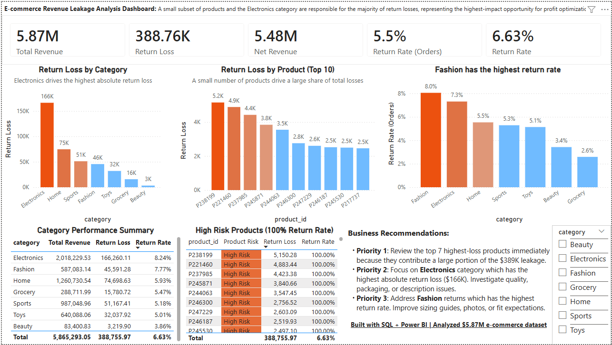

# 389K Revenue Recovery Analysis — SQL-Driven E-Commerce Returns Investigation


## Business Problem

> **$389K in return-driven revenue loss identified** across a $5.87M operation — with SQL-driven segmentation pinpointing exactly where to act first.

This analysis addresses the following questions:

- Where is revenue being lost due to returns?
- Which products and customers contribute most to financial impact?
- Is return behavior concentrated or evenly distributed?
- How can the business prioritize actions for maximum impact?

<br>

## Dashboard Preview



> Built in Power BI · Revenue overview · Customer risk segmentation · Product Pareto · Category breakdown

<br>

## Executive Summary

This project analyzes e-commerce return behavior and identifies the primary drivers of $389K+ in revenue loss using SQL-based analytical modeling.

Across product, customer, and time dimensions, the analysis reveals a highly concentrated loss structure where a small subset of products and customer behaviors account for a disproportionate share of financial impact.

The key finding is that revenue leakage is not random; it is structurally concentrated and predictable using historical return patterns.

| Metric | Value |
|:---|---:|
| Gross Revenue | $5,865,293 |
| Return Loss | $388,756 |
| Net Revenue | $5,476,537 |
| Overall Return Rate | 5.52% |

### Key Findings

- 🔴 **Electronics** is the top-revenue category — and the largest source of return loss ($166K)
- 🟠 **Fashion** has the highest return rate at **8.05%**, signalling expectation mismatch or fit issues
- 🟡 **Top 5 loss products** account for a disproportionate share of total leakage
- 🟢 **High-return customers** are mostly *not* the highest-value customers — risk and value require separate monitoring

- Approximately 80% of return-related revenue loss is concentrated in a small subset of products (Pareto distribution)
- Customer return behavior can be segmented into distinct risk tiers, with a small group of users responsible for repeated losses
- Retention declines sharply after the first purchase cycle, indicating weak long-term customer engagement
- Product categories with high return rates suggest structural issues such as expectation mismatch, quality inconsistency, or sizing problems

<br>

## How to Run This Project

1. Create database
2. Run: sql/01_schema.sql
3. Load data using: sql/02_data_loading.sql
4. Run analysis files in order:
   - 03_revenue_analysis.sql
   - 04_customer_analysis.sql
   - ... 10_time_analysis.sql

## Key SQL Highlights

This project demonstrates advanced analytical SQL, focusing on real business problems such as revenue leakage, customer risk behavior, and product-level loss prioritization.

Rather than simple aggregations, the queries below showcase window functions, CTE-based modeling, and business-driven segmentation logic.

---

### 1. Customer Return Risk Segmentation

This query classifies customers based on their return behavior to identify high-risk users contributing disproportionately to return volume.

```sql
SELECT
    customer_id,
    COUNT(o.order_id) AS total_orders,
    COUNT(r.return_id) AS total_returns,
    ROUND(COUNT(r.return_id) * 100.0 / COUNT(o.order_id), 2) AS return_rate_pct,
    CASE
        WHEN COUNT(o.order_id) >= 3
             AND COUNT(r.return_id) * 100.0 / COUNT(o.order_id) > 30 THEN 'High Risk'
        WHEN COUNT(o.order_id) >= 3
             AND COUNT(r.return_id) * 100.0 / COUNT(o.order_id) > 10 THEN 'Moderate Risk'
        ELSE 'Low Risk'
    END AS risk_segment
FROM customers c
LEFT JOIN orders o USING (customer_id)
LEFT JOIN returns r USING (order_id)
GROUP BY customer_id
ORDER BY return_rate_pct DESC;
```

### 2. Product Revenue Leakage Ranking

```sql
WITH product_revenue AS (
    SELECT
        p.product_id,
        p.category,
        SUM(o.order_value) AS gross_revenue,
        SUM(CASE 
                WHEN r.return_id IS NOT NULL THEN o.order_value 
                ELSE 0 
            END) AS return_loss,
        COUNT(r.return_id) AS return_count
    FROM products p
    JOIN orders o USING (product_id)
    LEFT JOIN returns r USING (order_id)
    GROUP BY p.product_id, p.category
)
SELECT
    product_id,
    category,
    gross_revenue,
    return_loss,
    ROUND(return_loss * 100.0 / NULLIF(gross_revenue, 0), 2) AS loss_rate_pct,
    RANK() OVER (ORDER BY return_loss DESC) AS loss_rank
FROM product_revenue
ORDER BY return_loss DESC;
```
### 3. Pareto Revenue Loss Analysis (Deep Dive)

This analysis identifies the small subset of products responsible for the majority of total return-related revenue loss using cumulative distribution logic.

To solve this, I implemented a Pareto analysis using SQL window functions to rank products and calculate cumulative contribution to total loss.

This allows the business to prioritize high-impact products rather than treating all returns equally.

```sql
WITH product_loss AS (
    SELECT 
        p.product_name,
        SUM(o.total_amount) AS total_loss
    FROM returns r
    JOIN orders o 
        ON r.order_id = o.order_id
    JOIN products p 
        ON o.product_id = p.product_id
    GROUP BY p.product_name
),
ranked AS (
    SELECT 
        product_name,
        total_loss,
        SUM(total_loss) OVER () AS total_loss_all,
        SUM(total_loss) OVER (ORDER BY total_loss DESC) AS cumulative_loss
    FROM product_loss
)
SELECT 
    product_name,
    total_loss,
    cumulative_loss,
    cumulative_loss / total_loss_all AS cumulative_pct
FROM ranked
ORDER BY total_loss DESC;
```

> Full SQL scripts → [`/sql`](sql/)

This query demonstrates:

- Window functions for cumulative analysis
- Ranking logic for prioritization
- Translation of raw data into business decision-making

Using this approach, the business can identify the small subset of products responsible for the majority of losses (Pareto principle).
<br>


## Project Structure

```
ecommerce-revenue-leakage/
│
├── data/
│   ├── raw/                        # Original Kaggle dataset (unmodified)
│   └── cleaned/                    # Normalized CSVs after ETL
│
├── docs/
│   ├── ERD.md                      # Entity relationship diagram + rationale
│   ├── ERD.png                     # Visual ERD (dbdiagram.io)
│   ├── architecture.md             # Pipeline architecture overview
│   ├── architecture_ETL.png        # ETL flow diagram
│   └── data_modeling.md            # Normalization decisions + SQL examples
│
├── sql/
│   ├── 01_schema.sql               # Table creation + foreign key constraints
│   ├── 02_data_loading.sql         # Staging ingest + ETL transforms
│   ├── 03_revenue_analysis.sql     # KPIs: gross revenue, return loss, net revenue
│   ├── 04_customer_analysis.sql    # LTV ranking + risk segmentation
│   ├── 05_product_analysis.sql     # Pareto analysis + loss ranking
│   └── 06_category_analysis.sql   # Category return rates + leakage
│
├── dashboard/
│   ├── dashboard_preview.png       # Static preview image
│   └── e-comm_dashboard.pbix       # Power BI dashboard file
│
└── README.md
```


<br>

## Architecture Overview

```
┌──────────────────────────────────────────────┐
│  SOURCE                                      │
│  Kaggle CSV — raw, denormalized, wide file   │
└─────────────────────┬────────────────────────┘
                      │
                      ▼
┌──────────────────────────────────────────────┐
│  STAGING                                     │
│  staging_ecommerce — loaded as-is            │
│  Preserves source integrity                  │
└─────────────────────┬────────────────────────┘
                      │  SQL ETL (02_data_loading.sql)
                      ▼
┌──────────────────────────────────────────────┐
│  NORMALIZED SCHEMA                           │
│                                              │
│  customers ──┐                               │
│              ├──► orders ──► returns         │
│  products ───┘                               │
│                                              │
│  FK constraints · no redundancy             │
└─────────────────────┬────────────────────────┘
                      │
                      ▼
┌──────────────────────────────────────────────┐
│  ANALYTICAL LAYER                            │
│  CTEs · Window functions · Aggregations      │
│  03 revenue · 04 customer · 05 product       │
│  06 category                                 │
└─────────────────────┬────────────────────────┘
                      │
                      ▼
┌──────────────────────────────────────────────┐
│  POWER BI DASHBOARD                          │
│  Revenue · Customer · Product · Category     │
└──────────────────────────────────────────────┘
```

> Full details → [`docs/architecture.md`](docs/architecture.md)

<br>

## Data Integrity and Validation

All analytical outputs are supported by validation steps to ensure accuracy and consistency:

- Row count reconciliation across data layers
- Duplicate detection in transactional records
- Revenue consistency checks before and after transformation
- Referential integrity validation between orders and returns
- Null and missing value checks in key fields

These checks ensure that all metrics are reliable and reproducible.


### Example: Revenue Reconciliation Check

```sql
-- Total revenue before cleaning
SELECT SUM(order_value) 
FROM staging_ecommerce;

-- Total revenue after transformation
SELECT SUM(total_amount) 
FROM orders;
```
This check ensures that no revenue is lost or artificially introduced during the transformation process.

Matching totals confirm that aggregation and normalization steps preserve financial accuracy.

These validation steps ensure that all downstream analysis is based on consistent, accurate, and trustworthy data.

> All validation queries are documented in: → [`sql/07_data_validation.sql`](sql/07_data_validation.sql)

## Join Pitfall Demonstration

A naive join between orders and returns can inflate revenue due to duplication.

This project demonstrates:
- incorrect aggregation approach
- corrected approach using deduplication

> Full details → [`sql/09_join_pitfall_demo.sql`](sql/09_join_pitfall_demo.sql)

## Analytical Approach

| Layer | Focus | Key Output |
|:---|:---|:---|
| Revenue Overview | Baseline health metrics | $389K leakage on $5.87M revenue |
| Customer Analysis | LTV vs. return risk separation | Risk segments: High / Moderate / Low |
| Product Analysis | SKU-level Pareto of losses | Top 5 products = outsized leakage share |
| Category Analysis | Return rate + loss by segment | Electronics = highest loss · Fashion = highest rate |

<br>

## Business Recommendations & Prioritization

The goal of this analysis is not only to identify return-related revenue loss, but to prioritize actions that can maximize recovery with minimal effort.

Using SQL-based analysis, key loss drivers were ranked based on their financial impact and return behavior.

### Top Priorities

1. **Focus on High-Loss Products (Pareto Effect)**
   - A small subset of products contributes to a large portion of total revenue loss.
   - These products should be prioritized for investigation (quality issues, sizing, product mismatch).

2. **Target High Return Rate Categories**
   - Categories such as [replace with your actual category, e.g., Fashion] show significantly higher return rates.
   - These may require changes in product descriptions, sizing guides, or customer expectations.

3. **Investigate Repeat Return Behavior**
   - Customers with multiple returns represent higher risk.
   - Policies such as return limits or targeted interventions can reduce losses.

4. **Monitor Return Trends Over Time**
   - If return rates are increasing, this may indicate operational or product issues.
   - Early detection allows proactive correction.
  
### Why This Prioritization Matters

Not all returns have equal business impact.

By focusing on:
- high-value losses instead of all returns  
- top-contributing products instead of all products  
- repeat patterns instead of isolated cases  

The business can allocate resources efficiently and achieve faster revenue recovery.

These recommendations are directly supported by SQL analysis, including:
- product-level loss ranking
- return rate segmentation
- cumulative contribution (Pareto analysis)

### Strategic Recommendation

The most effective path to reducing revenue loss is prioritization, not uniform optimization.

Focusing on the top contributors to loss (products and customers) will yield significantly higher ROI than attempting to reduce return rates across the entire catalog.

<br>

## Customer Behavior Analysis

To better understand return patterns, customers were segmented based on their return behavior.

This analysis identifies high-risk customer groups who contribute disproportionately to return-related losses.

Using SQL, customers were classified into risk segments based on their return rate:

- No Returns
- Low Risk
- Moderate Risk
- High Risk

This segmentation allows the business to:

- Identify customers with consistently high return behavior  
- Apply targeted policies (e.g., return limits or review flags)  
- Reduce loss from repeat return patterns

## Cohort Analysis — Repeat Purchase Behavior

This analysis groups customers by first purchase month and tracks 
return activity over time.

**Important data context:** The dataset contains orders from 
Oct–Dec 2023 and Oct–Dec 2024 only. Months 3–9 are absent from 
the data, so this analysis measures long-term reactivation 
rather than continuous retention.

| Cohort | Month 0 Customers | Month 1 Return Rate | ~12-Month Return Rate |
|:---|---:|---:|---:|
| Oct 2023 | 961 | 11.2% | 12.3% |
| Nov 2023 | 795 | 12.1% | 13.7% |
| Dec 2023 | 795 | — | 12.6% |
| Oct 2024 | 700 | 11.7% | — |

**Key finding:** Approximately 11–13% of customers reactivate 
~12 months after their first purchase, suggesting a meaningful 
annual repeat-buyer segment. Short-term month-1 retention 
(~12%) is consistent across cohorts.

**Honest limitation:** Without data for months 2–9, we cannot 
assess mid-term retention or determine whether the 12-month 
reactivation represents genuine loyalty or seasonal coincidence.


### Business Implications

Retention drops sharply after month 1 and stabilizes at a low baseline, indicating structurally weak repeat purchase behavior.

From a business perspective, this indicates:

- Limited long-term customer value (low repeat behavior)
- High dependency on acquiring new customers instead of retaining existing ones
- Potential issues in product satisfaction or post-purchase experience


### Recommended Actions

- Improve post-purchase engagement (email flows, recommendations, follow-ups)
- Investigate early-stage customer experience issues
- Focus on increasing second-purchase conversion rate (critical retention milestone)

> Full cohort analysis SQL available in  → [``/sql/12_cohort_analysis.sql``](`/sql/12_cohort_analysis.sql`)

## If I Were the Analyst Here

This analysis enables the business to:

- Prioritize high-impact products responsible for the majority of losses
- Identify and manage high-risk customer segments
- Improve retention by addressing early lifecycle drop-off
- Shift from descriptive reporting to decision-driven analytics

<br>

## Dataset

[Kaggle: E-Commerce Dataset — Orders & Returns](https://www.kaggle.com/datasets/angellawl/e-commerce-dataset-order-and-return?utm_source=chatgpt.com)

<br>

## Tools


## Related Docs

| Document | Description |
|:---|:---|
| [`docs/data_modeling.md`](docs/data_modeling.md) | Normalization decisions, ETL transforms, schema validation |
| [`docs/ERD.md`](docs/ERD.md) | Entity relationship diagram with design rationale |
| [`docs/architecture.md`](docs/architecture.md) | Full pipeline architecture breakdown |

