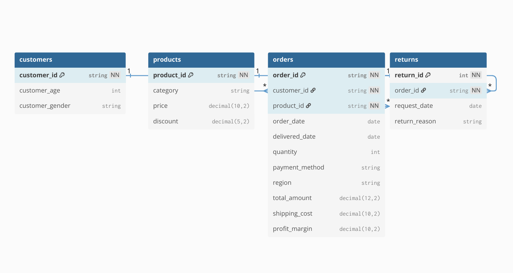

# Entity Relationship Diagram (ERD)

## Overview

The data model for this project was designed to support accurate, multi-dimensional analysis of return-driven revenue leakage. The schema closely mirrors the structure of the source dataset while eliminating redundancy and enabling efficient SQL joins across customers, products, orders, and returns.



---

## Schema
```
customers
─────────────────────────
customer_id   PK
customer_age  INTEGER
customer_gender TEXT

products
─────────────────────────
product_id    PK
category      TEXT
price         REAL
discount      REAL

orders
─────────────────────────
order_id        PK
customer_id     FK → customers
product_id      FK → products
order_date      DATE
delivered_date  DATE
quantity        INTEGER
payment_method  TEXT
region          TEXT
total_amount    REAL
shipping_cost   REAL
profit_margin   REAL

returns
─────────────────────────
return_id     PK (AUTOINCREMENT)
order_id      FK → orders (UNIQUE)
request_date  DATE
return_reason TEXT
```

---

## Relationships

| Relationship | Cardinality | Notes |
|---|---|---|
| customers → orders | 1 : N | One customer can place many orders |
| products → orders | 1 : N | One product can appear in many orders |
| orders → returns | 1 : 0..1 | Each order has at most one return |

The dataset structure has one product per order — no separate `order_items` table was needed. Returns are linked directly to orders rather than customers or products, which enables precise revenue leakage calculations without double-counting.

---

## Design Rationale

**Why normalize at all?**
The raw Kaggle data is a single denormalized CSV. Normalizing it into four tables eliminates repeated customer and product data across rows, reduces the risk of aggregation errors, and mirrors how this data would actually be stored in a production e-commerce database.

**Why center the model on `orders`?**
Orders are the unit of analysis for both revenue (order value) and returns (return linked to a specific order). Everything else — customer demographics, product metadata, return records — joins through the orders table. This makes complex aggregations clean and avoids ambiguous fan-out joins.

**Why a 1:0..1 relationship for returns?**
The dataset does not support multiple returns per order, and business logic typically treats a return as tied to a specific transaction. Modeling it as optional (0..1) on the order side keeps the schema honest about what the data actually contains.

---

## Analytical Impact

This structure directly enabled the project's key findings:

- **Category-level return loss** — joining `products.category` through `orders` to `returns` allows clean aggregation of return value by category with no cross-joins
- **Customer risk segmentation** — joining `customers` to `orders` to `returns` enables return rate calculation per customer with full order history context
- **Product Pareto analysis** — the same join path, grouped by `product_id`, surfaces which SKUs drive disproportionate leakage
- **100%-return-rate flagging** — a simple ratio of `COUNT(return_id) / COUNT(order_id)` per product, with a sample-size filter to avoid flagging single-order products unfairly

---

## Tool Used

ERD designed in [dbdiagram.io](https://dbdiagram.io).

